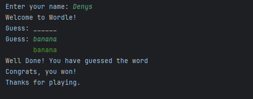
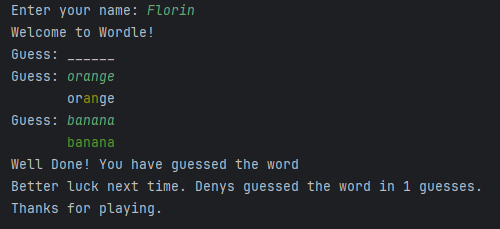

# Wordle1v1
### Denys-Florin Cot

## Wordle game with a 1v1 mechanism

A Simple Wordle game running in a terminal. After 2 players connect to the server, the wordle game starts. Each player will try to guess the secret word using a minimum number of guesses. After the players guess the word or use all their chances, they will get the outcome of the game, the player taking the fewest number of guesses winning the game. Uses the socket API, crating a TCP connection to the server, after each guess, the server process it and returns a proper answer.

### Resources
Markdown Guide, [Online] Available: https://www.markdownguide.org/basic-syntax/ [accesed: Mar 14, 1706]
